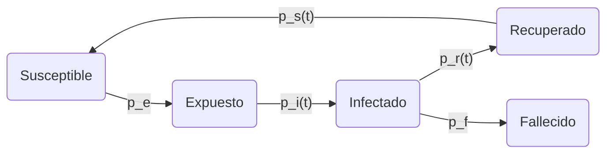
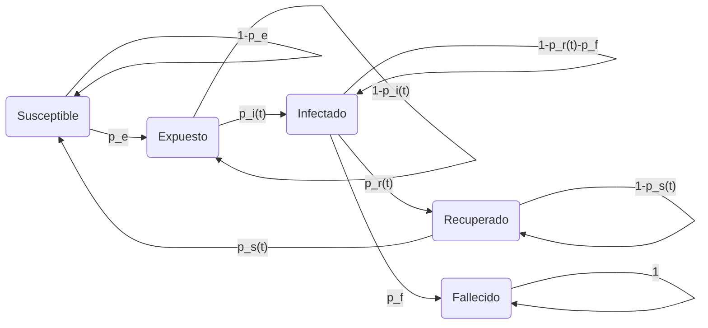

# Modelo de covid-19 usando un _autómata celular_ 

En este proyecto, se usará un modelo de _autómata celular_ (AC) para el covid-19.

## Objetivos
### Objetivo general
- [] Determinar ...

### Objetivos específicos
- [x] Comparar resultados del modelo con datos reales (para algunos casos)
- [ ] Probar con distintos valores de `p_e`, `R_0`

## Hipótesis
Existen medidas que al ser implementadas pueden disminuir el número de fallecidos por covid-19.

## Modelo

Trabajamos con un AC probabilístico (las funciones de transición son probabilísticas?).

* `p_e` es la probabilidad de que una persona en Susceptible pase a Expuesto.
Se calcula a partir de la cantidad de personas que puedan transmitir la enfermedad dentro de su vecindad.
Se consideran las personas dentro de la celda donde se encuentra como en los alrededores.

* `p_i(t)` es la probabilidad de que una persona en Expuesto pase a Infectado.
Esta probabilidad depende del tiempo.

* `p_r(t)` es la probabilidad de que la persona en Infectado pase a Recuperado.
Esta probabilidad depende del tiempo.

* `p_f` es la probabilidad de que la persona en Infectado pase a Fallecido.

* `p_s(t)` es la probabilidad de que la persona en Recuperado pase a Susceptible.
Esta probabilidad depende del tiempo.

>Nota: este diagrama está algo incompleto, en cada iteración tenemos esas probabilidades. No es la probabilidad acumulada

Algo más realista sería considerar una *cadena de Markov*, o _proceso estocástico_.

Sin embargo, existen aún dudas respecto a la función de transición para el estado **Infectado**.

En este caso, el tiempo de incubación tiene que ver con el tiempo para pasar de **Expuesto** a **Infectado**.

## Resultados
El desarrollo del trabajo puede consultarse en este [link](https://colab.research.google.com/drive/1v3FekVwXWa2tei9MpZKhAYlXvtUbW5AB#scrollTo=Qivco0Q-J8KP).